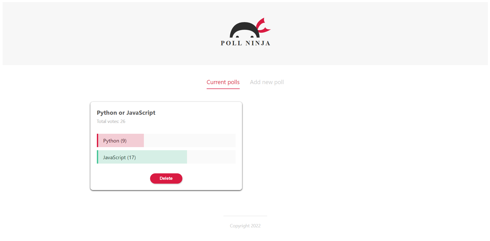
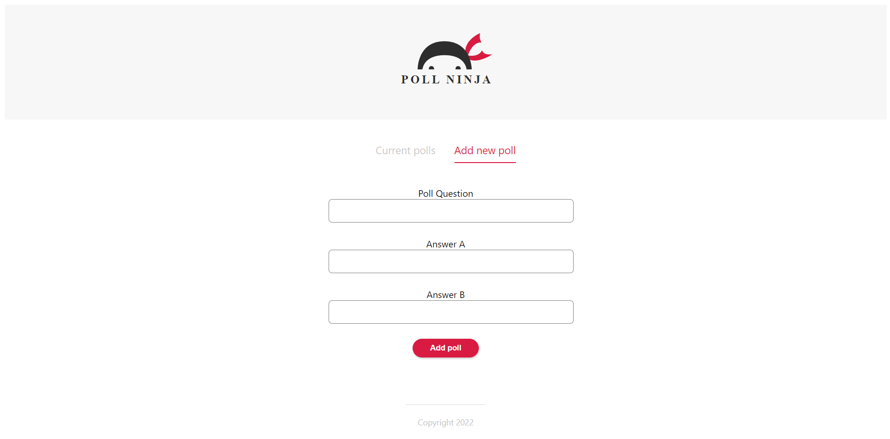

# Polls Ninja App 🗳🤏     

      

       

From this Polls Ninja App, user can make two option and poll or vote one of it. The amount of poll will be updated after user click to poll. However, it is only work in client side, which is not integration with any backend solution.


Thanks to the [Shaun/The Net Ninja](https://github.com/iamshaunjp) to guide this tutorial, which is I was followed along the [Svelte Tutorial for Beginners](https://www.youtube.com/playlist?list=PL4cUxeGkcC9hlbrVO_2QFVqVPhlZmz7tO) on his YouTube channel.


This Feedback app was built on top of Svelte + Vite.


To test this website locally, you need to have [Node.js](https://nodejs.org/en/) installed on your local machine. Then, kindly download the zip file of the source code. After extract the folder, open the terminal and type

```Shell
	npm install
	// This will install all the dependencies of the project
```


To run the Feedback App in development mode, type 

```Shell
	npm run dev
```

To build the original source code into JavaScript bundle, type

```Shell
	npm run build
```

To run the Feedback App in distribution/preview mode, type

```Shell
	npm run preview
```
